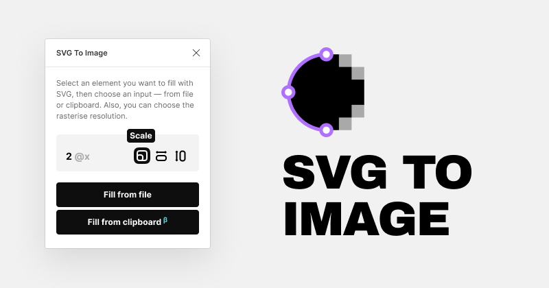

# SVG To Image

Use SVG as raster images in Figma. A simple solution for SVG import.

[Install Plugin](https://www.figma.com/community/plugin/891448180042913164)

Check the demo on [Youtube](https://youtu.be/8jlZCFvIhdo)

Enjoy!

Any question please leave in the Issues or send me directly at [laptev.graphics@gmail.com](mailto:laptev.graphics@gmail.com)
